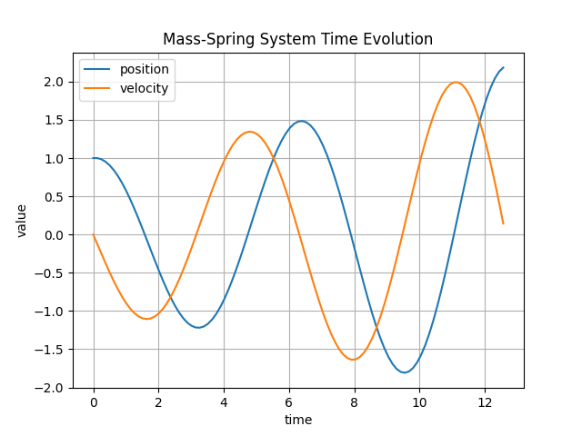
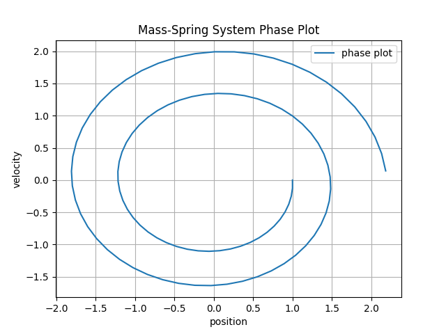
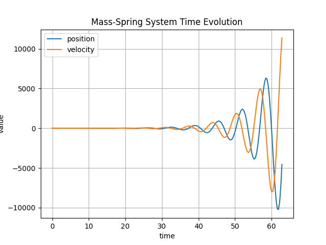
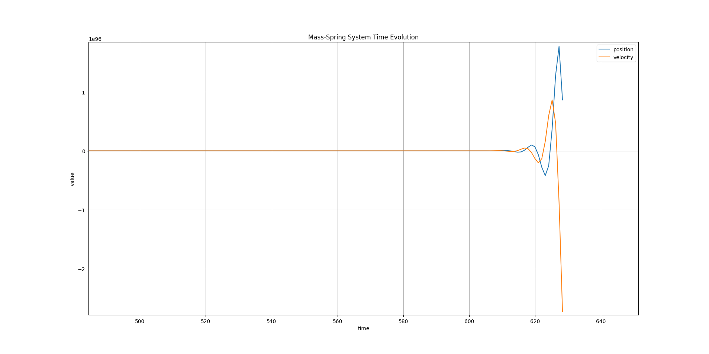
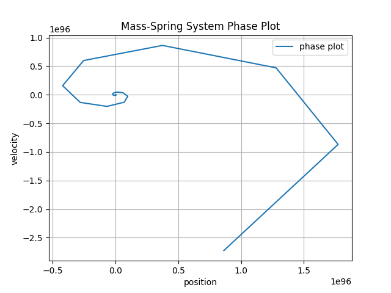
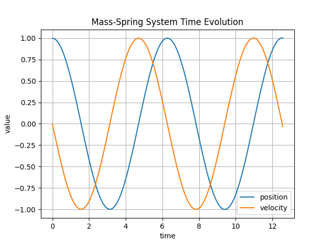
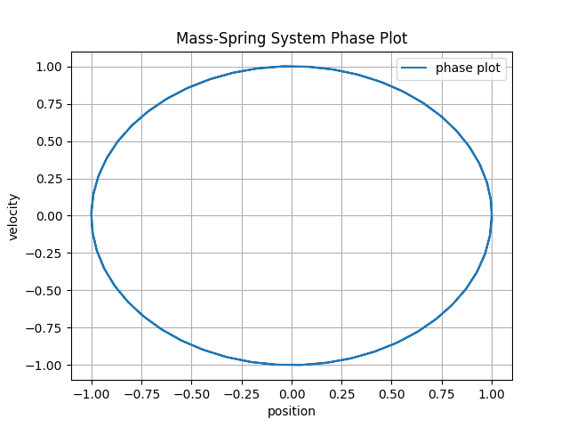
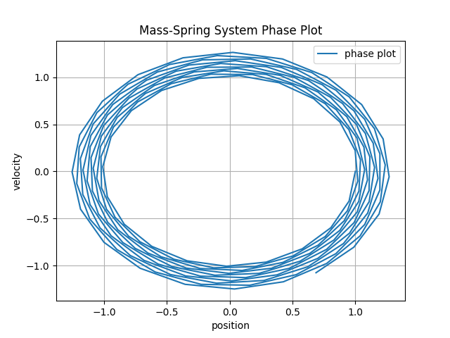
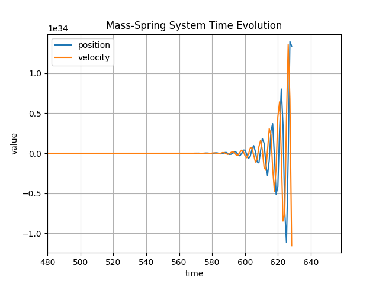
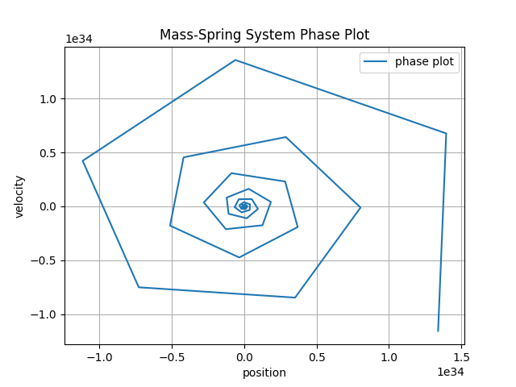

# Mass–Spring System Simulation Report
## Explicit Euler vs Improved Euler 

Author: Metehan Demircioglu -- Edeh Ekene -- Pierre Valat
      
---

## 1. Introduction

numerical solutions of a mass–spring system using two methods:

- Explicit Euler
- Improved Euler 

The governing ODE is:

x' = v  
v' = -x

We compare  behavior for multiple step sizes.

---

## 2. Numerical Methods

### 2.1 Explicit Euler

Formula:
y_{n+1} = y_n + t f(y_n)

---

### 2.2 Improved Euler 

Formulas:
y_tilde = y_n + (t/2) f(y_n)  
y_{n+1} = y_n + t f(y_tilde)

---

## 3. Results

Below are the time-evolution and phase-space results for all tested step sizes.  
---

# 4. Explicit Euler Results

## 4.1 Small Step Size (Stable Short-Term)

**Time evolution**

**Phase plot**

---

## 4.2 Moderate Step Size (Unstable)

**Time evolution**

**Phase plot**

---

## 4.3 Large End-Time (Blow-up)

**Time evolution**

**Phase plot**

---

# 5. Improved Euler Results

## 5.1 Small Step Size

**Time evolution**

**Phase plot**

---

## 5.2 Moderate Step Size

**Time evolution**

**Phase plot**

---

## 5.3 Large End-Time

**Time evolution**

**Phase plot**

---

# 6. Comparison

| Feature | Explicit Euler | Improved Euler  |
|--------|----------------|-----------------------|
| Order | 1 | 2 |
| Stability | Poor | Good |
| Phase-space | Outward spiral | Closed ellipse |
| Long-time behavior | Blow-up | Stable (slow drift) |

---

# 7. Conclusions

- Explicit Euler becomes unstable for oscillatory systems.
- Improved Euler  gives significantly more accurate and stable results.

---

# 8. Figures Included

